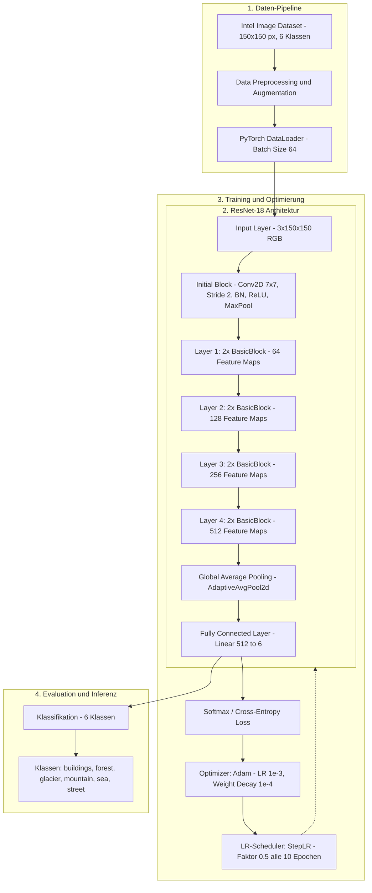

```mermaid
graph TD
    subgraph Data_Pipeline [1. Daten-Pipeline]
        A[Intel Image Dataset - 150x150 px, 6 Klassen] --> B[Data Preprocessing und Augmentation]
        B --> C[PyTorch DataLoader - Batch Size 64]
    end

    subgraph Model_Architecture [2. ResNet-18 Architektur]
        C --> D[Input Layer - 3x150x150 RGB]
        D --> E[Initial Block - Conv2D 7x7, Stride 2, BN, ReLU, MaxPool]
        
        E --> F[Layer 1: 2x BasicBlock - 64 Feature Maps]
        F --> G[Layer 2: 2x BasicBlock - 128 Feature Maps]
        G --> H[Layer 3: 2x BasicBlock - 256 Feature Maps]
        H --> I[Layer 4: 2x BasicBlock - 512 Feature Maps]
        
        I --> J[Global Average Pooling - AdaptiveAvgPool2d]
        J --> K[Fully Connected Layer - Linear 512 to 6]
    end

    subgraph Training_Optimization [3. Training und Optimierung]
        K --> L[Softmax / Cross-Entropy Loss]
        L --> M[Optimizer: Adam - LR 1e-3, Weight Decay 1e-4]
        M --> N[LR-Scheduler: StepLR - Faktor 0.5 alle 10 Epochen]
        N -.-> Model_Architecture
    end

    subgraph Output [4. Evaluation und Inferenz]
        K --> O[Klassifikation - 6 Klassen]
        O --> P[Klassen: buildings, forest, glacier, mountain, sea, street]
    end
```